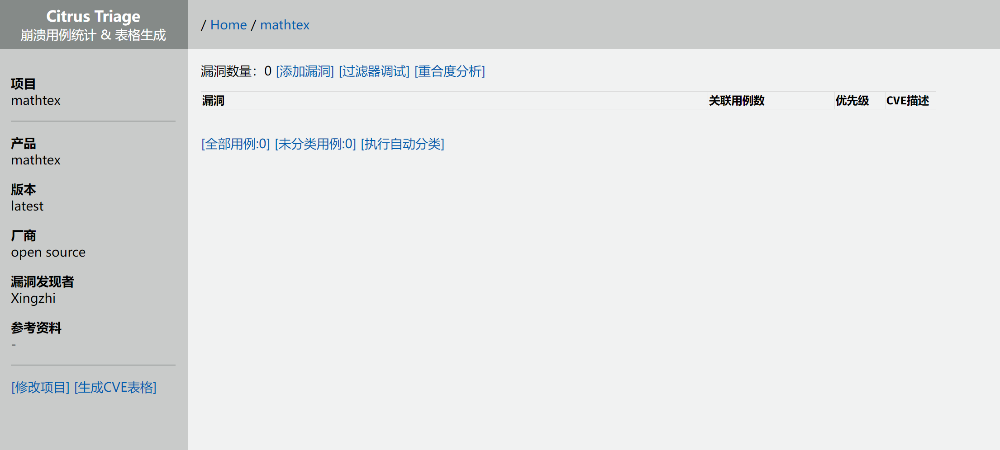
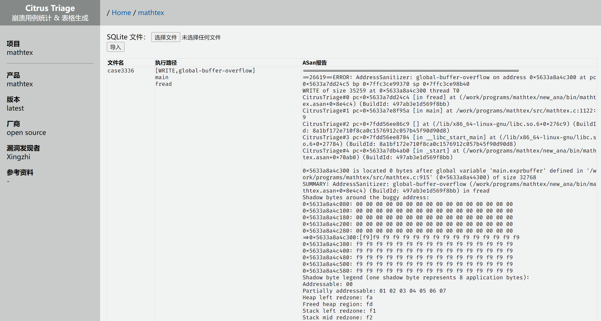
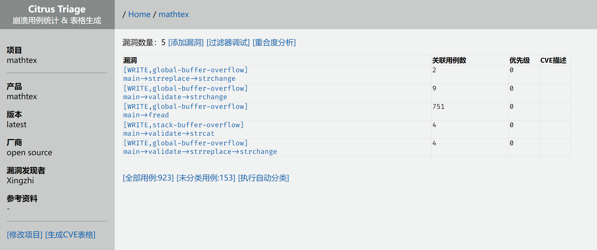
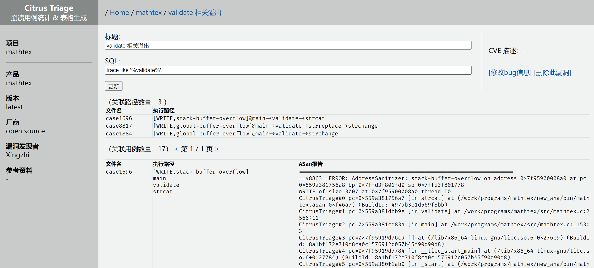
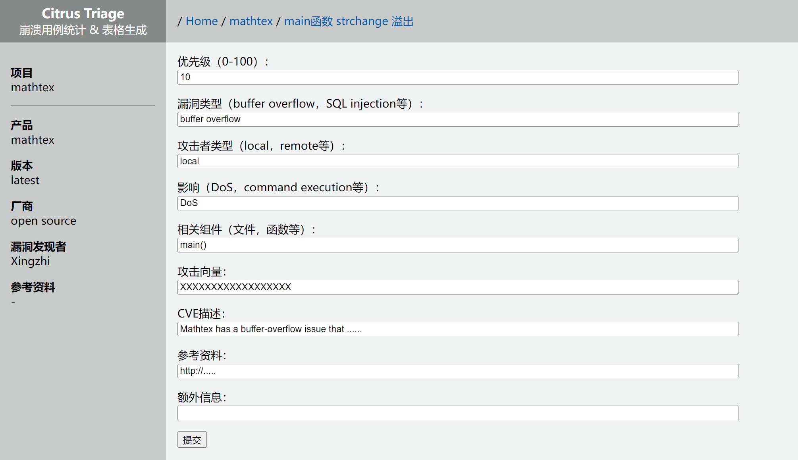

# Citrus Triage

玩具项目，用来辅助分析 fuzz 过程产生的 114514 个 crash 用例，并自动生成 CVE 申请表（MITRE 格式）。

基本思路：

1. 用 ASan 跑程序，记录崩溃路径
2. 按崩溃路径自动分类
3. 人工分析这些路径，合并同类项，标记


## 启动

首先准备一个 PostgreSQL 数据库。

如果手头有现成的，可以把 URI 写进 `.env`；否则，使用以下指令建立一个：

```bash
cd citrus_pgsql
docker-compose up -d
```

初始化数据库：
```bash
python3 init_db.py
```

运行平台：
```bash
python3 app.py
```

## 使用指南

首先，点击「添加项目」按钮，建立一个新项目。点击左侧的「修改项目」按钮，以设置项目名等信息。




### 导入 crash

为了导入 crash，您需要上传一个 SQLite3 数据库文件到 Citrus Triage。接下来，我们会介绍如何生成这个数据库文件。

首先，用 ASan 跑一遍程序。您需要自己写个脚本来收集 ASan 的报告，注意 `stack_trace_format` 一定要符合 Citrus 的格式。模板如下：

```python
import os
import subprocess
import multiprocessing

def work(filename):
    asan_opt = 'ASAN_OPTIONS=\'hard_rss_limit_mb=200,stack_trace_format="CitrusTriage#%n pc=%p [%F] at %L"\''
    cmd = f'./bin/mathtex.asan "./all_crashes/{filename}" >/dev/null 2> "./reports/{filename}"'

    p = subprocess.Popen(asan_opt + ' ' + cmd, shell=True)
    try:
        p.wait(10)
    except subprocess.TimeoutExpired:
        p.kill()

        with open(f'./reports/{filename}', 'w') as f:
            f.write('Popen:Timeout')

pool = multiprocessing.Pool(multiprocessing.cpu_count() - 2)

files = os.listdir('all_crashes')
os.system('mkdir -p reports')

pool.map(work, files)
```

现在，`all_crashes` 目录下是所有 crash 用例，`reports` 目录下是 ASan 报告。

运行以下脚本，生成数据库文件：

```python
import os
import sqlite3
from tqdm import tqdm

db = sqlite3.connect('crash_case.db')
db.execute('DROP TABLE IF EXISTS info')

db.execute('CREATE TABLE info (filename TEXT, data BLOB, asan_report TEXT)')
db.commit()

for f in tqdm(os.listdir('reports')):
    data = open(os.path.join('all_crashes', f), 'rb').read()
    asan_report = open(os.path.join('reports', f), encoding='latin1').read()

    db.execute('INSERT INTO info (filename, data, asan_report) VALUES (?, ?, ?)', [f, data, asan_report])

db.commit()

print(db.execute('select count(*) from info').fetchall()[0][0], 'rows')
```

现在，目录下生成了 `crash_case.db`。在平台上点击「全部用例」按钮，上传这个文件。




### 分析

首先点击「执行自动分类」按钮。平台会按照执行路径，自动分类漏洞。




这里面有 5 个漏洞，假设我们分析之后，认为 `validate()` 函数中的 crash 都应该算作相同漏洞，那我们就写这样的 SQL 过滤器：

```sql
trace LIKE '%validate%'
```

这样就可以选中此类 crash。



### 编写 CVE 描述

对于每个漏洞，可以填写 CVE 描述，以便之后导出 CVE 申请表格。



可以用「优先级」字段调整各个漏洞的汇报顺序。优先级不为 0 的漏洞会被写进 CVE 申请表。

其他字段的语义与 MITRE CVE form 一致。

产品、版本、厂商、漏洞发现者、参考资料这些字段可以在项目设置页面统一填写。

### 导出 CVE

点击项目页面左侧的「生成CVE表格」按钮。

优先级大于 0 的漏洞会被导出。导出文件包括：

- 一份描述文档，按照这份文档填写 MITRE CVE 申请表
- 对于每个漏洞，给出样例 crash 文件及其 ASan 报告

## 注意事项

**不要把平台对公网开放。**

这个项目有 SQL 注入漏洞，会导致 RCE，而且开发者不会去尝试修理。

